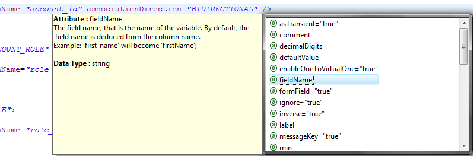

# Celerio Configuration

A thorough configuration file example is provided when you create a project out of the sample H2 database that we provide.
The file is located under `src/main/config/maven-celerio-plugin/maven-celerio-plugin.xml`.

This configuration file allows you to override conventions and control more precisely what is generated. 
For example, you may want to rename some variables, make some associations bidirectional, change a type, etc.

Here are the main configuration points (this is a work in progress):

* [Inline documentation through XSD](#xsd)
* [Entity ID](#entity_id)
	* [Use a SEQUENCE per TABLE](#seq_per_table)
	* [Use a custom Id generator](#cust_id_generator)
* [Entity and property names](#naming)
	* [Force an entity name](#entity_name)
	* [Force a property name](#property_name)
	* [Advanced property name calculation](#name_rule)
* [Type Mapping](#type_mapping)
	* [Force a type mapping locally](#force_mapping)
	* [Number mapping customization](#rule_number_mapping)
	* [Date mapping customization](#rule_date_mapping)               
* [Associations](#associations)
	* [@ManyToOne](#m2o)
	* [@OneToMany](#o2m)
	* [@OneToOne](#o2o)
	* [Inverse @OneToOne](#io2o)
	* [@ManyToMany](#m2m)
* [Conventions](#conventions)
	* [File Upload and Download](#conventions-file)
	* [Audit entity](#conventions-audit-entity)
	* [Audit table](#conventions-audit-table)
	* [Saved search](#conventions-saved-search)
 

# Inline documentation through XSD
Before editing your configuration file, make sure that Eclipse displays the documentation present in the
`celerio.xsd` file and that it suggests the available tags.

From Eclipse, you cannot work efficiently without the help of the XSD documentation.

# Entity ID

If you rely on conventions, you do not need to configure anything regarding Ids. These examples are for advanced usage. 

## Use a SEQUENCE per TABLE
 
 In case you use a sequence per table to generate your primary key values, you must configure Celerio in order to take
 it into account. Here is an example:
 

    <entityConfigs>
        <entityConfig tableName="ADDRESS" sequenceName="ADDRESS_SEQ"/>
    </entityConfigs>


assuming the PK of the ADDRESS table is mapped to an Integer, here is how would look the generated code:


    @Column(name = "ADDRESS_ID", nullable = false, unique = true, precision = 5)
    @GeneratedValue(strategy = GenerationType.SEQUENCE, generator = "ADDRESS_SEQ")
    @Id
    @SequenceGenerator(name = "ADDRESS_SEQ", sequenceName = "ADDRESS_SEQ")
    public Integer getAddressId() {
        return addressId;
    }


## Use a custom Id generator

In certain cases, generally when you work with legacy databases, you may need to use a custom Id generator
in order to be consistent with the legacy system. Here is an example:

    <entityConfig tableName="ADDRESS">
        <columnConfigs>
            <columnConfig columnName="ADDRESS_ID">
                <generatedValue generator="myCustomerGenerator" />
                <genericGenerator name="myCustomerGenerator" strategy="com.yourcompany.appli.customgen.CustomerGenerator">
                    <parameters>
                        <parameter name="sequence" value="YOUR_EVNTUAL_SEQ" />
                    </parameters>
                </genericGenerator>
            </columnConfig>
        </columnConfigs>
    </entityConfig>


leads to:


    @Column(name = "ADDRESS_ID", nullable = false, unique = true, precision = 5)
    @GeneratedValue(generator = "myCustomerGenerator")
    @GenericGenerator(name = "myCustomerGenerator", strategy = "com.yourcompany.appli.customgen.CustomerGenerator", 
        parameters = @Parameter(name = "sequence", value = "YOUR_EVNTUAL_SEQ"))
    @Id
    public Integer getAddressId() {
        return addressId;
    }          


# Entity and property names

## Force an entity name

By default, an entity name is deduced from the Table name. To force the entity name to a different value, use the 
`entityName` attribute of the `entityConfig` element, for example.


    <entityConfigs>
        <entityConfig tableName="ACCOUNT" entityName="UserAccount"/>    
    </entityConfigs>


## Force a property name

By default, a property name is deduced from the column name. To force the property name to a different value, use the
`fieldName` attribute of the `columnConfig` element, for example.


    <entityConfigs>
        <entityConfig tableName="ACCOUNT">
            <columnConfigs>
                <columnConfig columnName="user_dob" fieldName="birthDate"/>
            </columnConfigs>
        </entityConfig>
    </entityConfigs>


leads to:


    Date birthDate;


## Advanced property name calculation
            
By default Celerio calculates Java field name based on the underlying column name. 
The `fieldNaming` element allows you to change the column names passed to Celerio 
to calculate the default field names. The example below removes well known prefix pattern from column names:


    <configuration>
        <conventions>
            <fieldNaming regexp="^.{3}_{1}" replace=""/>
        </conventions>
    </configuration>


In that case, column names such as `XYZ_SOMETHING_MEANINGFUL` now lead to Java field name `sometingMeaningful`
instead of `xyzSometingMeaningful`.

# Type Mapping

Celerio has some conventions regarding type mapping. You can change them either locally or globally using rules.

## Force a type mapping locally

You can force the mapped type using the `mappedType` attribute of the columnConfig element. For example to force
a mapping to an Integer you would do:


    <entityConfigs>
        <entityConfig tableName="ACCOUNT">
    	    <columnConfigs>
                <columnConfig columnName="year" mappedType="M_INTEGER"/>
            </columnConfigs>
        </entityConfig>
    </entityConfigs>


## Number mapping customization

You can configure number mapping rules globally. For example, to map all columns whose size and decimal digits are &gt; 1 to BigDecimal, 
proceed as follow: 


    <configuration>
        <numberMappings>
            <numberMapping mappedType="M_BIGDECIMAL" columnSizeMin="1" columnDecimalDigitsMin="1"/>  
        </numberMappings>
    </configuration>


First rule that matches is used. For example to map to either Boolean, Double or BigDecimal you can do:


    <configuration>
        <numberMappings>
            <numberMapping mappedType="M_BOOLEAN" columnSizeMin="1" columnSizeMax="2" columnDecimalDigitsMin="0" columnDecimalDigitsMax="1"/>    
            <numberMapping mappedType="M_DOUBLE" columnSizeMin="1" columnSizeMax="11" columnDecimalDigitsMin="1" columnDecimalDigitsMax="4"/>
            <numberMapping mappedType="M_BIGDECIMAL" columnSizeMin="11" columnDecimalDigitsMin="4"/>  
        </numberMappings>
    </configuration>              


Note that the `columnSizeMin` is inclusive and `columnSizeMax` is exclusive.
         
               
## Date mapping customization

You can configure date mapping rules globally. For example, to map all date/time/timestamp column to Joda Time LocalDateTime, proceed as follow:


    <configuration>
        <dateMappings>
            <dateMapping mappedType="M_JODA_LOCALDATETIME" />  
        </dateMappings>
    </configuration>


And for example to map differently the columns whose name is VERSION you can add the following mapping rule:


    <configuration>
        <dateMappings>
            <dateMapping mappedType="M_UTILDATE" columnNameRegExp="VERSION"/>  
            <dateMapping mappedType="M_JODA_LOCALDATETIME" />  
        </dateMappings>
    </configuration>


# Associations

## @ManyToOne

By default, Celerio generates the code for a `@ManyToOne` association when it encounters a column 
having a `foreign key` constraint and no `unique` constraint.

The variable name of the many to one association is deduced by default from the
`fieldName` of the column. For example if the `fieldName` is `addressId`, the many to one variable name will be `address`. 


    // column name is 'addr_id' 
    Address addr;
    
    // column name is 'address'
    Address address;
    
    // column name is 'anything_else'
    Address anythingElse;


In any case, use the `manyToOneConfig` element to force a different variable name. For example:


    <columnConfig columnName="addr_id">
        <manyToOneConfig var="myAddress"/>
    </columnConfig>


will lead to


    Address myAddress;


The `manyToOneConfig` element also allows you to tune the JPA fetch type and the JPA cascade types.
Please refer to the XSD for more information.

If you have some inheritance involved on the 'one' side of the many to one association, the table referenced by the foreign key is not
enough to identify the target entity. In that case, set the `targetEntityName` attribute of the `columnConfig` element. For example:


    <columnConfig columnName="address_id" targetEntityName="HomeAddress"/>


On legacy schema, the foreign key constraint may not be present and Celerio will not generate the many to one association
you would expect.

Hopefully you can configure Celerio to do as if a foreign key constraint was present by setting the `targetTableName` attribute of the
`columnConfig` element. For example:
                

    <columnConfig columnName="address_id" targetTableName="ADDRESS"/>


## @OneToMany

One to many association is configured on the 'many' side of the association, more precisely on the same
`columnConfig` as the one used for the associated many to one association. 
This may be a bit confusing at first but it has the advantage to group together, both associations on the side that really owns the association.

Celerio generates the code for one to many association when a many to one association is present and when the
`associationDirection` attribute of the `columnConfig` element is `BIDIRECTIONAL`. For example:
                

    <entityConfig tableName="Account">
        <columnConfig columnName="address_id" associationDirection="BIDIRECTIONAL"/>
    </entityConfig>


will lead (assuming address_id refers to Address) to something like:


    // in Account.java
    Address address;



    // In Address.java
    List<Account> accounts;

            
In the example above `accounts`
is simply the plural of the Account entity that Celerio guessed. We were of course lucky on this one.

Use the `oneToManyConfig` element of the `columnAttribute` to set the name of the one to many association
to a different value. As you will see, you can also set the name of an element of the collection
to control the name of the associated helper methods that Celerio generates (adder, remover, etc.). Here is an example:


    <entityConfig tableName="Account">
        <columnConfig columnName="address_id" associationDirection="BIDIRECTIONAL">
            <oneToManyConfig var="people" elementVar="resident"/>
        </columnConfig>
    </entityConfig>


will lead to


    // In Address.java
    List<Account> people;
    
    public void addResident(Account resident) {
    // skip...
    }


The `oneToManyConfig` element also allows you to tune the JPA fetch type and the JPA cascade types.
Please refer to the XSD for more information.

## @OneToOne
            
By default, Celerio generates the code for a `@OneToOne` association when it encounters a column having a
`foreign key` constraint AND a `unique` constraint.

One to one associations are very similar to many to one associations.
To change the variable name, the JPA fetch type or the cascade types of the
one to one association, use the `oneToOne` element of the `columnConfig` element.
            

## Inverse @OneToOne

Inverse one to one association is for one to one association what one to many association is for many to one association.

Celerio generates the code for inverse one to one association when a one to one association is present and when the
`associationDirection` attribute of the `columnConfig` element is `BIDIRECTIONAL`.

Inverse one to one association is configured on the owning side of association, that is on the
`columnConfig` that has the foreign key and unique constraints. As for one to many association, 
this may be a bit confusing at first but it has the advantage to group together, both associations 
on the side that really owns the association.

## @ManyToMany
            
Many to many association necessarily involves a join table. When Celerio detects a join table, it generates the code for the many to many
relation. Celerio assumes that a table is a join table when it has 2 foreign keys and no other columns, except eventually a primary key column and
a column used for optimistic locking.

To fine tune the many to many association, you must declare an entityConfig for the join table.
You may use the `manyToManyConfig` element. to set the related variables and adder/remover/etc. method names. 
You can use the `inverse` attribute to force the inverse side of the association. For example:
           

    <entityConfig tableName="account_role" associationDirection="BIDIRECTIONAL">
        <columnConfigs>
            <columnConfig columnName="account_id">
                <manyToManyConfig var="theAccounts" elementVar="anAccount"/>
            </columnConfig>
            <columnConfig columnName="role_id" inverse="true">
                <manyToManyConfig var="theRoles" elementVar="aRole"/>                
            </columnConfig>
        </columnConfigs>
    </entityConfig>


In case Celerio does not detect the join table, for example if an extra column is present, you can force it by setting
to `true` the `middleTable` attribute of the `entityConfig` element.

# Conventions

## File Upload and Download

When the following columns are present simultaneously in a
table, Celerio generates various helper methods to ease file
manipulation from the web tier to the persistence layer.

* 'prefix'_file_name (String)
* 'prefix'_content_type (String)
* 'prefix'_size or 'prefix'_length or 'prefix'_content_length (int)
* 'prefix'_binary or 'prefix'_content or 'prefix'_blob or  (blob)

Example: Here is the corresponding SQL code using 'mydoc' as a 'prefix'


    mydoc_content_type      varchar(255)    not null,
    mydoc_size              integer         not null,
    mydoc_file_name         varchar(255)    not null,
    mydoc_binary            bytea,


This convention allows you to upload a file transparently, 
save it to the corresponding table, then download it using a simple URL.

## Auditing entity

When the following columns are present simultaneously in a
table, Celerio will use these columns to save the creation and last update using jpa listeners.

* creationAuthor, creationBy, creePar (Date)
* creationDate, dateCreation (Date)
* lastModificationAuthor, lastModificationAt, derniereModificationPar, modifiePar (String)
* lastModificationDate, dateDerniereModification, derniereModification (String)

Example: 


    creation_date            timestamp,
    creation_author          varchar(200),
    last_modification_date   timestamp,
    last_modification_author varchar(200),


## Audit table

When the following columns are present simultaneously in a
table, Celerio will use these columns to save the creation and last update using jpa listeners.

The table should be called either

* audit
* audit_log
* audit_trail

The table should contain the following columns

* author‚ auteur (String)
* event (String)
* eventDate (Date)
* stringAttribute1, attribute1, string1 (String)
* stringAttribute2, attribute2, string2 (String)
* stringAttribute3, attribute3, string3 (String)

## Saved search table

When the following columns are present simultaneously in a
table, Celerio will use these columns to propose the user to save its searches

The table should be called either

* saved_search
* saved_search_form

The table should contain the following columns

* formClass, formClassname (String)
* name (String)
* formContent (blob)
* creationAuthor, creationBy, creePar, accountId (fk to account)

Example: 


    CREATE TABLE SAVED_SEARCH (
        id                            int not null IDENTITY,
        name                          varchar(128) not null,
        form_classname                varchar(256) not null,
        form_content                  bytea,
        account_id                    char(36) not null,
    
        constraint saved_search_fk_1 foreign key (account_id) references ACCOUNT,
        primary key (id)
    );


